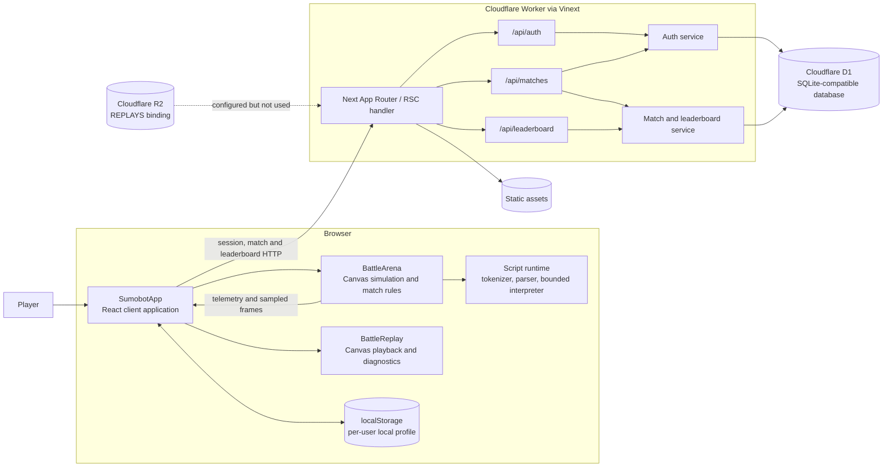
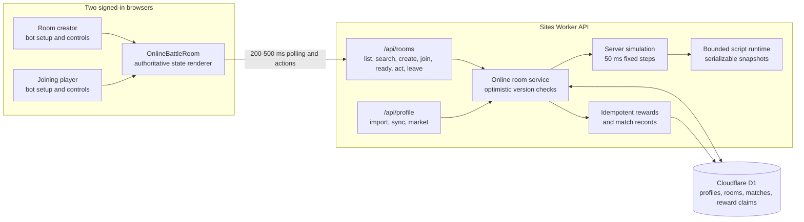
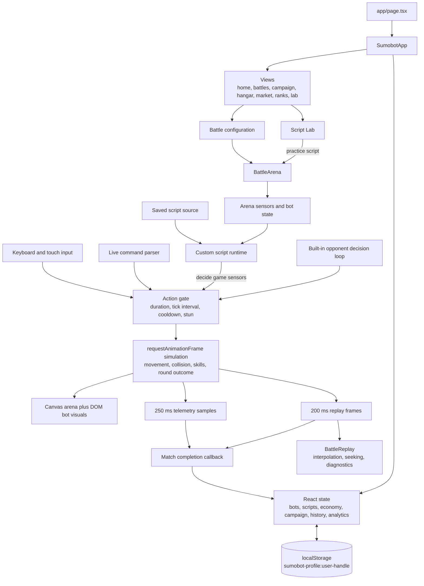
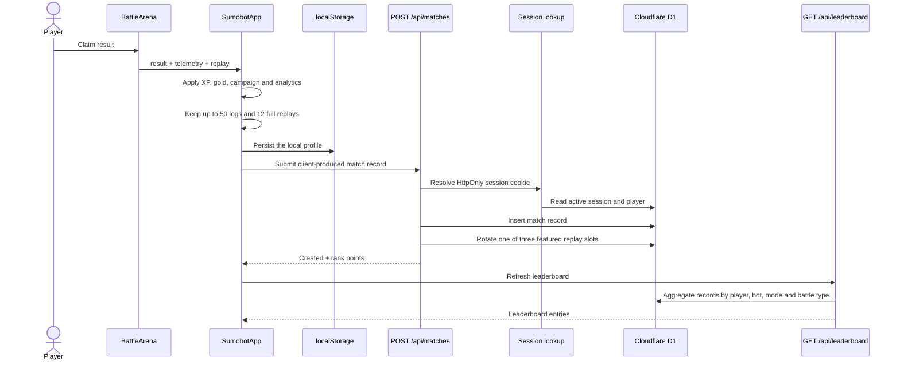
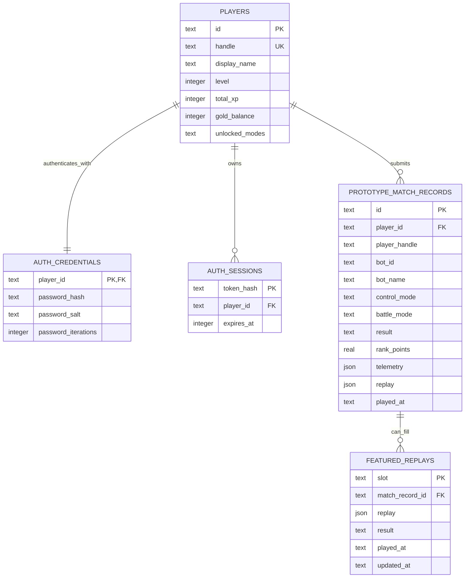

# Sumobot Web Architecture

This document describes the architecture implemented on the `online-alpha` branch as of 2026-08-10. It deliberately separates the authoritative online PvP path from the retained browser-simulated PvAI and Lab paths.

## System overview

The database is now authoritative for account profiles, economy, rooms, PvP outcomes, public records, and leaderboards. Existing browser profiles are imported once and retained only as a device cache. PvAI and Lab simulations still run in the browser; PvP simulation, scripts, scoring, rewards, and disconnect outcomes run on the server.

## Online multiplayer architecture

Sites currently exposes D1 and R2 bindings but not a dedicated stateful room binding, so the online alpha uses a Sites-compatible HTTP authoritative loop. Each room state has a monotonically increasing version; concurrent updates use compare-and-swap writes and retry. The server advances physics from the last persisted simulation timestamp whenever a player polls or submits an action.

Room lifecycle:

1. The creator chooses public or private access, control mode, timing, and a bot.
2. The guest joins publicly or with the correct hashed private code.
3. Both players receive a 30-second setup deadline and may press Ready early.
4. When both are ready, the server starts a five-second countdown.
5. The server creates and advances the authoritative best-of-three simulation.
6. Explicit departure or a missed heartbeat ends the match as a forfeit.
7. A unique per-room reward claim updates both profiles and public match records exactly once.

## Browser component and gameplay flow

### Simulation authority

`BattleArena` remains the source of truth only for PvAI and Lab matches. Its animation loop:

1. accepts button, live-command, or script actions;
2. runs the opponent decision loop;
3. updates motion and cooldown state;
4. resolves collisions, Stone reflection, stun, and arena exits;
5. advances the best-of-three match state;
6. samples telemetry every 250 ms and replay frames every 200 ms; and
7. returns the final result, telemetry, and replay to `SumobotApp` only after the player claims the result.

For PvP, `lib/online/simulation.ts` is the source of truth. Button and Live actions are validated by the server; Script actions are produced by the bounded interpreter on the server with serialized global state between requests. Clients render returned positions and cannot submit outcomes, rewards, or scores.

## Match completion sequence

Practice matches stop after the local callback and do not grant rewards, update analytics, or submit a public record.

## Active persistence model

The active tables above are created lazily by `ensureAuthSchema` and `ensureMatchSchema`. Passwords use PBKDF2-SHA-256 with per-account salts. Session cookies are HttpOnly, SameSite=Lax, and valid for seven days; only a SHA-256 hash of each session token is stored.

## Data ownership and extension boundaries

| Concern | Current owner | Current persistence | Natural extension boundary |
| --- | --- | --- | --- |
| Live simulation and physics | `BattleArena` in the browser | In-memory refs/state | Move the same commands and rules to an authoritative realtime room |
| Bot scripts | `SumobotApp` and the bounded DSL runtime | Browser `localStorage` | Persist versioned scripts using `bot_profiles` and `bot_versions` |
| Inventory, loadout, currency, campaign | `SumobotApp` | Browser `localStorage` | Wire the corresponding Drizzle tables and server mutations |
| Account and session | Auth API/service | D1 | Add rate limiting, recovery, and account lifecycle operations |
| Public match history and featured replay | Match API/service | D1 JSON columns | Store compact replay manifests in D1 and replay streams in R2 |
| Leaderboard | SQL aggregation over prototype matches | Computed from D1 on request | Materialize seasonal entries and validate authoritative results |
| Analytics | Browser aggregation from telemetry/replays | Browser `localStorage` | Process replay streams asynchronously into `analytics_summaries` |

Online-alpha ownership overrides:

| Concern | Authoritative owner | Persistence |
| --- | --- | --- |
| PvP rooms, readiness, countdown and heartbeat | Online room service | `online_rooms` in D1 |
| PvP physics, scripts, telemetry and replay capture | Server simulation | Versioned JSON room state in D1 |
| Bots, scripts, loadouts, inventory, economy, campaign and history | Profile API | `online_profiles` plus player totals in D1 |
| Reward idempotency | Match/profile services | `online_reward_claims` in D1 |

`db/schema.ts` already defines the intended expanded model (`bot_profiles`, `bot_versions`, inventory/loadout/economy, campaign, normalized matches/rounds/participants, leaderboard entries, replay artifacts, and analytics summaries). Those tables are architectural placeholders today: application routes do not read or write them. Likewise, the `REPLAYS` R2 binding is configured, but replay payloads are currently stored directly in D1.

## Key implementation map

| Area | Primary files |
| --- | --- |
| Application shell and feature orchestration | `app/components/SumobotApp.tsx` |
| Live battle, rules execution, telemetry, replay capture | `app/components/BattleArena.tsx` |
| Replay playback and diagnostics | `app/components/BattleReplay.tsx`, `app/components/BotDiagnosticsPanels.tsx` |
| Script language parser and interpreter | `lib/game/script-runtime.ts` |
| Shared game constants and rewards | `lib/game/rules.ts` |
| Authentication routes and service | `app/api/auth/route.ts`, `lib/auth/server.ts` |
| Match and leaderboard routes and service | `app/api/matches/route.ts`, `app/api/leaderboard/route.ts`, `lib/matches/server.ts` |
| Online rooms and authoritative simulation | `app/api/rooms/route.ts`, `lib/online/server.ts`, `lib/online/simulation.ts` |
| Online profile migration and persistence | `app/api/profile/route.ts`, `lib/profile/server.ts` |
| PvP room browser, lobby and battle renderer | `app/components/OnlineRooms.tsx` |
| Database model and migrations | `db/schema.ts`, `drizzle/` |
| Edge deployment entry and bindings | `worker/index.ts`, `vite.config.ts`, `.openai/hosting.json` |

## Important constraints for future changes

- PvAI outcomes still originate in the browser and are submitted to the match API; PvP outcomes are server-generated.
- Online profiles use optimistic revisions. A stale device write receives the latest server profile instead of overwriting newer rewards.
- The online alpha uses HTTP polling because Sites currently provisions D1/R2 bindings. A future persistent-connection milestone can move each room behind WebSockets and a stateful room runtime without changing the client room contract.
- API schemas are hand-written SQL at runtime even though Drizzle schema and migrations are present. Schema evolution should converge on one migration path before production use.
- Replays are compact tuple arrays, but they are still embedded as JSON in D1 and capped at 750,000 serialized characters per submission.
- The Worker has image, D1, static asset, and R2 bindings. Only D1 and static assets participate in current application data flows.
